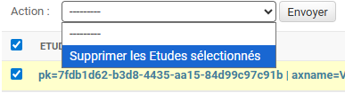
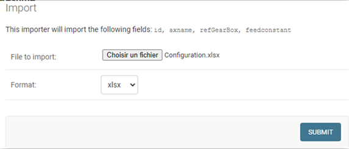

[< Retour](index.md)

# Configuration application Diagnostic

L'application **Diagnostic** permet :

- l'analyse des **couples moteurs**
- l'analyse de la **configuration des moteurs**

---

## Sommaire

- [Analyse des couples](#analyse-des-couples)
- [Configuration moteurs](#configuration-moteurs)
  - [Format du fichier d'import](#format-du-fichier-dimport)
  - [Génération automatique du fichier](#génération-automatique-du-fichier)
  - [Installation de l'outil](#installation-de-loutil)
  - [Utilisation](#utilisation)
  - [Résultat](#résultat)
  - [Génération manuelle du fichier](#génération-manuelle-du-fichier)
  - [Importer le fichier](#importer-le-fichier)

---

# Analyse des couples

La partie **analyse des couples** est configurée par défaut avec des **règles standard**.

Ces règles peuvent être adaptées si nécessaire, mais **aucune configuration n'est requise pour une utilisation de base**.

---

# Configuration moteurs

La partie **configuration moteurs** nécessite l'import de données depuis un fichier **Excel (.xlsx)**.

Les données doivent être définies **pour chaque moteur**.

Exemple :

```

Nom du moteur       : VMB17A01
Référence réducteur : PA722_0500
Feed constant       : 360

```

Ces informations peuvent être récupérées dans **l'organisation mémoire de la machine**.

---

## Format du fichier d'import

Le fichier Excel (.xlsx) doit contenir **3 colonnes** :

| AXNAME   | REFGEARBOX | FEEDCONSTANT |
| -------- | ---------- | ------------ |
| VMB17A01 | PA722_0500 | 360          |
| VMB17A02 | PA722_0500 | 360          |
| VMB17A03 | PA722_0500 | 360          |

---

## Génération automatique du fichier

Afin d'éviter de créer ce fichier **manuellement**, un outil permet de générer automatiquement le fichier d'import.

---

## Installation de l'outil

### 1️⃣ Récupérer les outils

Récupérer le dossier suivant sur le partage :

```

Z:\Electrique\developpement\arp_web_machine\Utilitaires\awm_import_generator

```

---

### 2️⃣ Ouvrir un terminal

Ouvrir **PowerShell** ou **CMD** en mode administrateur.

Se déplacer dans le dossier :

```bash
cd C:/.../awm_import_generator
```

---

### 3️⃣ Créer un environnement virtuel

```bash
py -3.9 -m venv .venv
```

---

### 4️⃣ Activer l'environnement virtuel

```bash
.venv\Scripts\activate
```

---

### 5️⃣ Installer les dépendances

```bash
pip install -r requirements.txt
```

---

## Utilisation

## Générer un fichier d'import Diagnostic

```bash
py .\src\set_diag_app.py
```

Le srcipt vous demandera le chemin vers l'**Organisation mémoire**.

```
D:\ARP\Machines\ARPXXX\electrique\Organisation_Mémoire_ARPXXX_VX.xlsm
```

---

## Résultat

Les fichiers générés seront disponibles dans le dossier :

```
out/
```

⚠️ Les logs vous **informent en cas de données manquantes**.

---

## Génération manuelle du fichier

Récupérer le fichier exemple présent sur le réseau :

```
Z:\Electrique\developpement\arp_web_machine\ExtStudyExemple.xlsx
```

---

## Importer le fichier

Ouvrir l'application dans un navigateur :

```
http://127.0.0.1:8xxx/fr/config/study/
```

Cliquer sur le bouton **Importer / Exporter**.

Avant d'importer, vous devez **supprimer les données existantes** :

1. Sélectionner **Tout**
2. Sélectionner **Supprimer les études sélectionnées**
3. Cliquer sur **Envoyer**
4. Cliquer sur **Oui, je suis sûr**




---

Cliquer ensuite sur **Importer** :

- Sélectionner le fichier Excel
- Valider l'import



---

Revenir ensuite à la page :

```
http://127.0.0.1:8xxx/fr/config/study/
```

Cliquer sur **Actualiser la configuration**.

Vérifier que les données sont correctement chargées.
