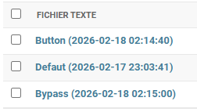
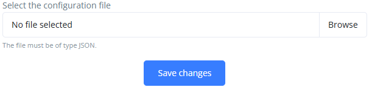

[< Retour](index.md)

# Configuration application Production

L'application **Production** permet :

- le **suivi de production des machines**
- calcul des **indicateurs de production (TRS)**
- l'analyse des **états machine**
- le suivi des **compteurs de production**
- l'affichage de **graphiques de production**
- l'historisation des **événements**

---

# Sommaire

- [Prérequis](#prérequis)
- [Génération des fichiers de configuration](#génération-des-fichiers-de-configuration)
  - [Installation de l’outil](#installation-de-loutil)
  - [Utilisation](#utilisation)
  - [Résultat](#résultat)

- [Description des fichiers générés](#description-des-fichiers-générés)

---

# Prérequis

La configuration de l’application Production nécessite :

- **Python 3.9**
- l’outil **AWM Import Generator**

Vérifier la version de Python :

```bash
python --version
```

---

# Génération des fichiers de configuration

La configuration de l’application Production s’effectue à partir de **l’organisation mémoire de la machine**.

Afin d’éviter de créer manuellement tous les fichiers de configuration, un outil permet de **générer automatiquement les fichiers nécessaires**.

---

# Installation de l’outil

## 1️⃣ Récupérer les outils

Récupérer le dossier suivant sur le réseau :

```
Z:\Electrique\developpement\arp_web_machine\Utilitaires\awm_import_generator
```

---

## 2️⃣ Ouvrir un terminal

Ouvrir **PowerShell** ou **CMD**.

Se déplacer dans le dossier :

```bash
cd C:/.../awm_import_generator
```

---

## 3️⃣ Créer un environnement virtuel

```bash
py -3.9 -m venv .venv
```

---

## 4️⃣ Activer l’environnement virtuel

```bash
.venv\Scripts\activate
```

Le terminal doit afficher :

```
(.venv)
```

---

## 5️⃣ Installer les dépendances

```bash
pip install -r requirements.txt
```

---

# Utilisation

Lancer le script de génération pour l’application Production :

```bash
py .\src\set_prod_app.py
```

Le script vous demandera plusieurs informations :

### 1️⃣ Chemin vers l’organisation mémoire

Exemple :

```
D:\ARP\Machines\ARPXXX\electrique\Organisation_Mémoire_ARPXXX_VX.xlsm
```

---

### 2️⃣ Langues utilisées

Le script demandera les langues utilisées dans la machine.

Exemple :

```
fr
en
```

---

### 3️⃣ Noms des machines

Le script demandera les noms des machines présentes dans la ligne.

---

# Résultat

Les fichiers générés sont enregistrés dans le dossier :

```
out/
```

Ces fichiers serviront à **configurer l’application Production**.

---

# Description des fichiers générés

## button.csv

Ce fichier contient :

- le **nom des boutons**
- leur **description**

Les identifiants utilisés sont :

```
Texte = 2_00_01_000 + numéro
Description = 2_00_02_000 + numéro
```

Les noms et descriptions sont générés à partir des informations présentes dans **l’organisation mémoire**.

---

## bypass.csv

Ce fichier contient :

- le **nom des bypass**
- leur **description**

Les identifiants utilisés sont :

```
Texte = 2_00_03_000 + numéro
Description = 2_00_04_000 + numéro
```

---

## defaut.csv

Ce fichier contient la **description des défauts machine**.

Identifiant utilisé :

```
Description = 1_00_00_000 + numéro
```

Les **noms des défauts** sont directement importés depuis le **PLC via l'application texte**.

---

## config_button_bypass.json

Ce fichier contient les **données complémentaires des boutons et bypass** :

- machine associée
- module (EM)
- alias programme PLC

Exemple :

```json
{
  "num": 1,
  "num_machine": 1,
  "num_em": 1,
  "alias": "S_ResetInit"
}
```

---

## config_machines.json

Ce fichier contient la **configuration complète des machines** :

- machines
- modules (EM)
- recettes (formats)
- états machine
- compteurs
- graphiques par défaut

Exemple simplifié :

```json
{
  "machines": [
    {
      "num": 1,
      "name_1": "Machine",
      "ems": [],
      "recipes": [],
      "states": [],
      "counters": []
    }
  ]
}
```

La génération de ce fichier s’appuie sur plusieurs feuilles de **l’organisation mémoire**.

---

### Modules (EM)

Les **noms des modules** sont récupérés dans la **feuille Sommaire**.

Exemple :

```
03D - Robot chargement courroie centrale
10A - Robot déchargement courroie centrale
```

---

### Défauts

Les défauts sont récupérés dans :

- les **feuilles modules** de l’organisation mémoire.

---

### Boutons et bypass

Les boutons et bypass sont récupérés dans :

- les **feuilles modules**
- les **SV Adresses**

---

### États machine

Les états machine sont récupérés dans la feuille :

```
Prod
```

Cette feuille contient :

- la **liste des états**
- leur **type**
- leur **couleur**
- leurs **traductions**

Exemple :

```json
{
  "bit": 0,
  "type": 4,
  "color": "#00c9a7",
  "locale": [
    {
      "language_code": "fr",
      "name": "Machine en automatique"
    }
  ]
}
```

---

### Compteurs

Les compteurs sont également définis dans la feuille :

```
Prod
```

Exemple :

```
Produits entrés
Produits sortis
Vitesse machine
```

---

### Graphiques par défaut

Les graphiques affichés par défaut dans l’application sont également définis dans la feuille :

```
Prod
```

Ils indiquent :

- quels **compteurs afficher**
- leur **couleur**

---

# Import dans l'application

Une fois les fichiers générés :

1. Ouvrir l'application Production dans le navigateur

```
http://127.0.0.1:9xxx/fr/admin/arp_webapp_txt/textfile/
```

2. Importer les fichiers générés `bypass.csv`, `button.csv` et `defaut.csv`.



3. Ouvrir l'application Production dans le navigateur

```
http://127.0.0.1:8000/en/modify-database/
```

4. Importer les fichiers générés `config_button_bypass.json` et `config_machines.json`.


