[< Retour](index.md)

# Installation manuelle AWM

⚠️ Le déploiement ne peut être effectué **qu'après l'installation des logiciels nécessaires**.

💡 Le déploiement **manuel** nécessite de nombreuses actions.  
Il est fortement conseillé d'utiliser la **méthode automatique**.

[Installation automatique AWM](_02_auto_deployement.md)

---

## Sommaire

- [Prérequis](#-prérequis)
- [Base de données](#-base-de-données)
- [Projet](#-projet)
- [Création de l'environnement virtuel Python](#-création-de-lenvironnement-virtuel-python)
- [IIS](#-iis)
  - [Création du site AWM*RECIPE*<ID>](#création-du-site-awm_recipe_id)
  - [Mappage du handler httpPlatformHandler](#configuration-du-handler)
  - [Répertoire virtuel static](#répertoire-virtuel-static)
  - [Répertoire virtuel media](#répertoire-virtuel-media)
  - [Lancement automatique du pool](#configuration-du-lancement-automatique)
  - [Préchargement du site](#activation-du-préchargement)
  - [Journalisation](#journalisation)
  - [Création du site AWM*APPS*<ID>](#création-du-site-awm_apps_id)
- [Services COM (NSSM)](#-services-com-nssm)
- [Nettoyage automatique des logs](#-nettoyage-automatique-des-logs)

---

# 📋 Prérequis

- Accès à internet vers `pypi.org:443`
- Récupérer le dossier suivant sur le partage :

```
Z:\Electrique\developpement\arp_web_machine\Utilitaires\awm_utils
```

- Récupérer le projet de base sur le partage :

```
Z:\Electrique\developpement\arp_web_machine\DerniereVersion\AWM
```

💡 `<ID>` correspond au numéro de la machine.

Exemples :

```
ARP105 → 105
ARP099 → 099
```

---

# 🗄 Base de données

1. Ouvrir le logiciel **MySQL Workbench**
2. Se connecter à **localhost:3306**

<details>
<summary>📷 Capture écran</summary>

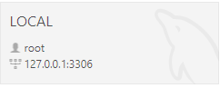

</details>

- User : `root`
- Mot de passe : `arp360arp360`

3. Cliquer en bas à gauche sur l'onglet **Schemas**
4. Clic-droit dans l'arborescence → **Create Schema...**
5. Nommer le schema :

```
arp_web_machine_<ID>
```

⚠️ Pour la machine **ARP99**, mettre `<ID>` = `099` → `arp_web_machine_099`

---

## Import de la base initiale

💡 Il est important d'importer la base **avant** d'exécuter les migrations Django.

6. Cliquer sur **Server → Data Import**

<details>
<summary>📷 Capture écran</summary>

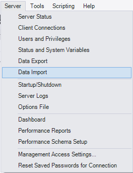

</details>

7. Choisir le fichier **dumps.sql** présent dans le projet de base :

```
AWM/Web/Db/init/dumps.sql
```

8. Sélectionner la base de données `arp_web_machine_<ID>`

<details>
<summary>📷 Capture écran</summary>

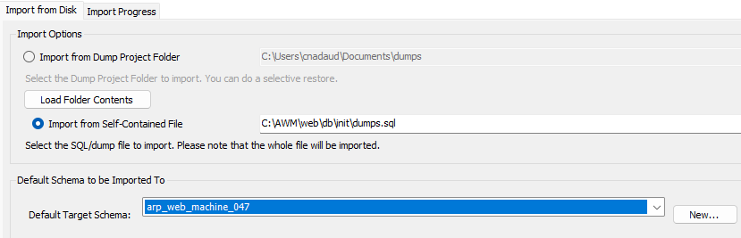

</details>

9. Cliquer sur **Start Import**

---

# 📁 Projet

1. Copier le projet vers le dossier cible.

⚠️ Sur un **superviseur**, le projet doit **toujours** être installé dans :

```
C:\AWM
```

2. Modifier le fichier `web.config`

Ce fichier est configuré avec les chemins `C:\AWM\`.  
Si votre projet est sur un chemin différent, adapter les chemins dans ce fichier.

3. Modifier le fichier `.env`

Exemple de configuration :

```
MACHINE_ID = <ID>
DEBUG = "False"
COM_EMULATOR = "False"
```

⚠️ Pour la machine **ARP99**, mettre `<ID>` = `099` → `MACHINE_ID = 099`

4. Modifier le fichier `conf.json`

Chemin du fichier :

```
C:\AWM\
 └── web\
      └── src\
        ├── conf.json
```

Dans ce fichier, définir les langues disponibles pour les **recettes**.

```
"langues": ["FR", "EN"]
```

Cela affichera les recettes en **français** et **anglais**.

- Langues disponibles :
  | Code | Langue |
  |-----|------|
  | FR | Français |
  | EN | Anglais |
  | ES | Espagnol |
  | DE | Allemand |
  | GR | Grec |

💡 Plusieurs langues peuvent être configurées simultanément :

```
"langues": ["FR", "EN", "GR"]
```

📝 Le mot de passe d'authentification pour les recettes peut être modifié dans ce fichier.

---

# Création de l'environnement virtuel Python

1. Ouvrir **PowerShell** ou **CMD** en mode administrateur
2. Se déplacer dans le dossier **AWM**

```bash
cd C:/AWM
```

3. Autoriser l'exécution de scripts (si nécessaire)

```bash
Set-ExecutionPolicy -ExecutionPolicy RemoteSigned -Scope CurrentUser
```

4. Créer un nouvel environnement virtuel

```bash
py -3.9 -m venv venv
```

5. Activer l'environnement

```bash
.\venv\Scripts\Activate.ps1
```

6. Installer les dépendances

```bash
pip install -r .\requirements.txt
```

7. Mettre à jour les fichiers statiques

```bash
py .\web\src\manage.py collectstatic
```

8. Générer les migrations

```bash
py .\web\src\manage.py makemigrations
```

9. Appliquer les migrations

```bash
py .\web\src\manage.py migrate --database=diagnostic_db
```

---

# 🌐 IIS

Deux sites seront créés :

- `AWM<ID>_RECIPE` : port `8000 + <ID>`
- `AWM<ID>_APPS` : port `9000 + <ID>`

💡 **AWM_APPS** permet la gestion de toutes les applications (hors recettes).  
💡 Les recettes sont gérées via **AWM_RECIPE**, sur un canal dédié pour une exécution indépendante.

---

## Création du site AWM_RECIPE_ID

1. Ouvrir le **Gestionnaire des services Internet (IIS)**
2. Clic droit sur **Sites** → **Ajouter un site...**

<details>
<summary>📷 Capture écran</summary>

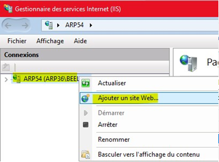

</details>

3. Renseigner les champs suivants :

- **Nom du site** : `AWM<ID>_RECIPE`
- **Chemin d'accès physique** : chemin du dossier **AWM** (ex : `C:\AWM`)
- **Port** : `9000 + <ID>` (ex : `9099` pour ARP099)

<details>
<summary>📷 Capture écran</summary>

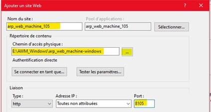

</details>

4. Déplier **Sites**, puis cliquer sur le site `AWM<ID>_RECIPE`
5. Cliquer sur **Mappages de gestionnaires**

<details>
<summary>📷 Capture écran</summary>

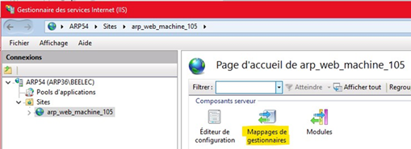

</details>

---

## Configuration du handler

6. Ajouter un mappage de module avec les champs suivants :

- **Chemin des demandes** : `*`
- **Module** : `httpPlatformHandler`
- **Exécutable** : laisser vide
- **Nom** : `AWMHandler`

<details>
<summary>📷 Capture écran</summary>

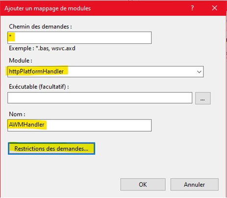

</details>

Ensuite :

- Cliquer sur **Restrictions des demandes** → onglet **Mappage**
- Décocher : **Appeler le gestionnaire seulement si une demande est mappée à :**
- Valider **OK**, puis **OK**

<details>
<summary>📷 Capture écran</summary>

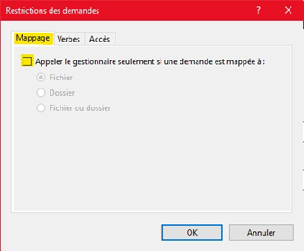

</details>

---

## Répertoire virtuel static

7. Ajouter le répertoire virtuel **static** :

- Sous **Sites**, clic droit sur le site `AWM<ID>_RECIPE` → **Ajouter un répertoire virtuel...**

<details>
<summary>📷 Capture écran</summary>

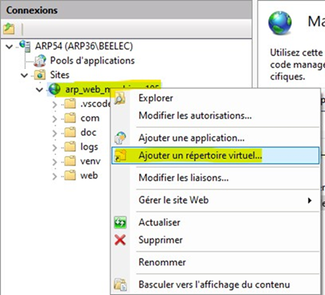

</details>

- Renseigner :
  - **Alias** : `static` (⚠️ tout en minuscule)
  - **Chemin d'accès physique** : `C:\AWM\web\src\static`

<details>
<summary>📷 Capture écran</summary>

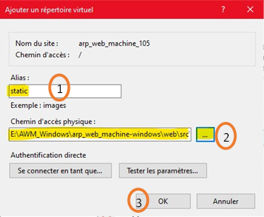

</details>

- Cliquer **OK**
- Cliquer sur le répertoire **static**
- Aller dans **Mappages de gestionnaires**
- Supprimer **AWMHandler** (uniquement pour `static`)

<details>
<summary>📷 Capture écran</summary>

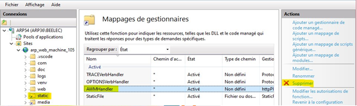

</details>

---

## Répertoire virtuel media

8. Ajouter le répertoire virtuel **media**

Faire la même chose que pour `static` mais avec :

- **Alias** : `media`
- **Chemin d'accès physique** : `C:\AWM\web\src\media`

---

## Configuration du lancement automatique

9. Configurer le lancement automatique du pool :

- Cliquer sur **Pools d'applications**
- Clic droit sur le pool `AWM<ID>_RECIPE` → **Paramètres avancés...**

<details>
<summary>📷 Capture écran</summary>

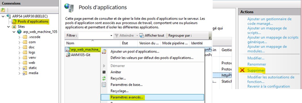

</details>

- Renseigner :
  - **Mode de démarrage** : `AlwaysRunning`
  - **Version du CLR .NET** : `Aucun code managé`
  - **Délai d'inactivité (minutes)** : `0`

<details>
<summary>📷 Capture écran</summary>

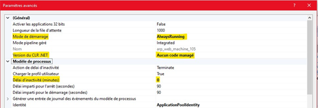

</details>

---

## Activation du préchargement

10. Activer le préchargement du site :

- Sous **Sites**, clic droit sur `AWM<ID>_RECIPE` → **Gérer le site** → **Paramètres avancés...**

<details>
<summary>📷 Capture écran</summary>

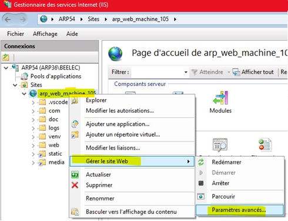

</details>

- Mettre **Préchargement activé** à `True`

<details>
<summary>📷 Capture écran</summary>

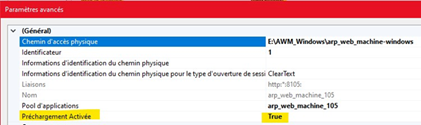

</details>

---

## Journalisation

<details>
<summary>📷 Capture écran</summary>

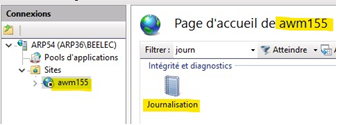
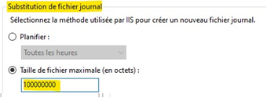

</details>

1. Créer un dossier dédié aux logs IIS :

```
C:\AWM\logs\IIS_RECIPE\
```

- Dans l'arborescence du projet :

```
logs/
└── IIS_RECIPE/
```

---

2. Ouvrir le **Gestionnaire des services Internet (IIS)**.

3. Sélectionner le site **AWMXXX_RECIPES**.

4. Cliquer sur **Journalisation**.

---

5. Configurer les paramètres suivants :

- **Répertoire** :

```
C:\AWM\logs\IIS_RECIPE\
```

- Cocher **Taille de fichier maximale**

- Renseigner :

```
100000000
```

---

💡 Cette configuration permet de :

- centraliser les logs IIS du site **RECIPES**
- éviter la génération de fichiers trop volumineux

## Création du site AWM_APPS_ID

11. Faire ensuite la même chose pour `AWM<ID>_APPS`

- Recommencer les étapes en nommant le site `AWM<ID>_APPS`
- Utiliser le port : `9000 + <ID>` (ex : `9099`)
- Nommer le fichier de log `IIS_APPS`

12. Une fois en marche, vérifier les logs dans le dossier **AWM**:

```
logs\IIS_APPS\...
logs\IIS_RECIPES\...
```

---

# 🔁 Services COM (NSSM)

Le déploiement AWM utilise **2 services Windows par COM** :

- **APPS**
- **RECIPE**

L'application peut utiliser jusqu'à **5 COMs**, soit **10 services Windows**.

💡 En mode automatique, les 10 services sont créés automatiquement.  
En mode manuel, la création est plus longue.

Dans la majorité des cas, **1 COM suffit**, donc seulement **2 services** :

```
AWM_COM_APPS_1
AWM_COM_RECIPE_1
```

---

## 1️⃣ Se déplacer dans le dossier NSSM

```bash
cd C:\nssm\
```

---

## 2️⃣ Créer le service AWM_COM_APPS_1

```bash
.\nssm.exe install AWM_COM_APPS_1
```

---

## 3️⃣ Configurer le service

<details>
<summary>📷 Capture écran</summary>

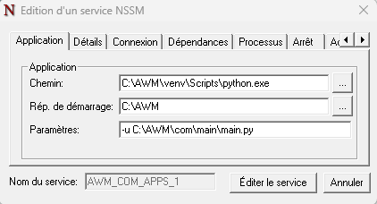
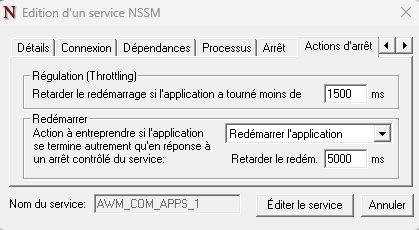
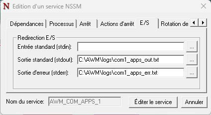
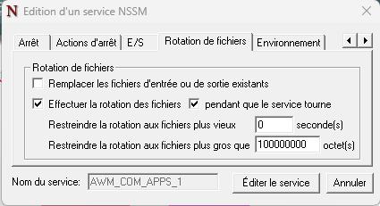
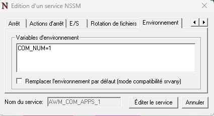

</details>

### Onglet **Application**

| Champ                   | Valeur                           |
| ----------------------- | -------------------------------- |
| Chemin                  | `C:\AWM\venv\Scripts\python.exe` |
| Répertoire de démarrage | `C:\AWM`                         |
| Paramètres              | `-u C:\AWM\com\main\main.py`     |

---

### Onglet **Actions d'arrêt**

```
Retarder le redémarrage : 5000 ms
```

---

### Onglet **E/S**

```
Sortie standard : C:\AWM\logs\com1_apps_out.txt
Sortie d'erreur : C:\AWM\logs\com1_apps_err.txt
```

---

### Onglet **Rotation des fichiers**

```
Restreindre la rotation aux fichiers plus gros que : 100000000
```

---

### Onglet **Environnement**

Ajouter la variable :

```
COM_NUM=1
```

---

## 4️⃣ Configurer les autres services APPS

Créer ensuite les services suivants :

```
AWM_COM_APPS_2 → AWM_COM_APPS_5
```

Modifier uniquement la variable d'environnement :

```
COM_NUM=2 → 5
```

---

## 5️⃣ Créer les services RECIPE

Créer ensuite :

```
AWM_COM_RECIPE_1 → AWM_COM_RECIPE_5
```

Modifier uniquement le **paramètre de lancement** :

```
-u C:\AWM\com\main\recipe.py
```

---

## 6️⃣ Vérifier les logs

Une fois les services démarrés, vérifier les fichiers dans le dossier **AWM** :

```
C:\AWM\
 └── logs\
      ├── IIS_APPS\
      ├── IIS_RECIPE\
      ├── com1_apps_out.txt
      ├── com1_apps_err.txt
      ├── com1_recipe_out.txt
      └── com1_recipe_err.txt
```

---

# Commandes NSSM utiles

### Éditer un service existant

```bash
.\nssm.exe edit AWM_COM_APPS_1
```

---

### Supprimer un service

```bash
.\nssm.exe remove AWM_COM_APPS_1 confirm
```

---

### Voir toutes les commandes NSSM

```bash
.\nssm.exe
```

---

# Gestion des services

Les services peuvent être **arrêtés ou redémarrés** depuis :

```
Services Windows
```

Si vous installez AWM sur votre **poste de développement**, il est conseillé de mettre les services en :

```
Démarrage manuel
```

Cela peut être modifié directement depuis **Services Windows**.

Oui. L’idée est d’ajouter une section expliquant **ce que fait le déploiement automatique pour la gestion des logs** afin que l’utilisateur puisse le reproduire manuellement.

Je te propose d’ajouter une section **après la partie "Vérifier les logs" ou après les services**, par exemple :

---

## 🧹 Nettoyage automatique des logs

Lors du **déploiement automatique**, une tâche planifiée Windows est créée afin de **nettoyer régulièrement les fichiers de logs**.

Cette tâche parcourt le dossier :

```
C:\AWM\logs
```

et **tous ses sous-dossiers** (par exemple `IIS_APPS\W3SVC*` ou `IIS_RECIPE\W3SVC*`) puis **supprime les fichiers vieux de plus de 14 jours**.

En mode **déploiement manuel**, cette tâche doit être créée manuellement.

---

### 1️⃣ Vérifier le fichier de nettoyage

Le script utilisé est :

```
C:\AWM\cleanup_logs.ps1
```

⚠️ Ce script contient par défaut le chemin :

```
C:\AWM\
```

Si votre installation utilise un **chemin différent**, modifier ce chemin dans le fichier.

---

### 2️⃣ Créer la tâche planifiée

1. Ouvrir **Planificateur de tâches** (`taskschd.msc`)
2. Cliquer sur **Créer une tâche…**

Configurer les paramètres suivants :

**Nom de la tâche**

```
AWM_LogCleanup_<ID>
```

Exemple :

```
AWM_LogCleanup_105
```

---

### 3️⃣ Déclencheur

Créer un déclencheur :

```
Tous les jours
Heure : 12:00
```

---

### 4️⃣ Action

Configurer l'action suivante :

**Programme :**

```
powershell.exe
```

**Arguments :**

```
-ExecutionPolicy Bypass -File C:\AWM\cleanup_logs.ps1
```

---

### 5️⃣ Vérification

Après création, la tâche doit apparaître dans :

```
Task Scheduler Library
```

et être dans l'état :

```
Ready
```

---

### 6️⃣ Test manuel

Le script peut être exécuté manuellement avec :

```bash
powershell -ExecutionPolicy Bypass -File C:\AWM\cleanup_logs.ps1
```

---

### Résultat

Cette tâche permet de :

- éviter l'accumulation de logs IIS
- éviter un remplissage du disque
- maintenir uniquement **14 jours d'historique**
