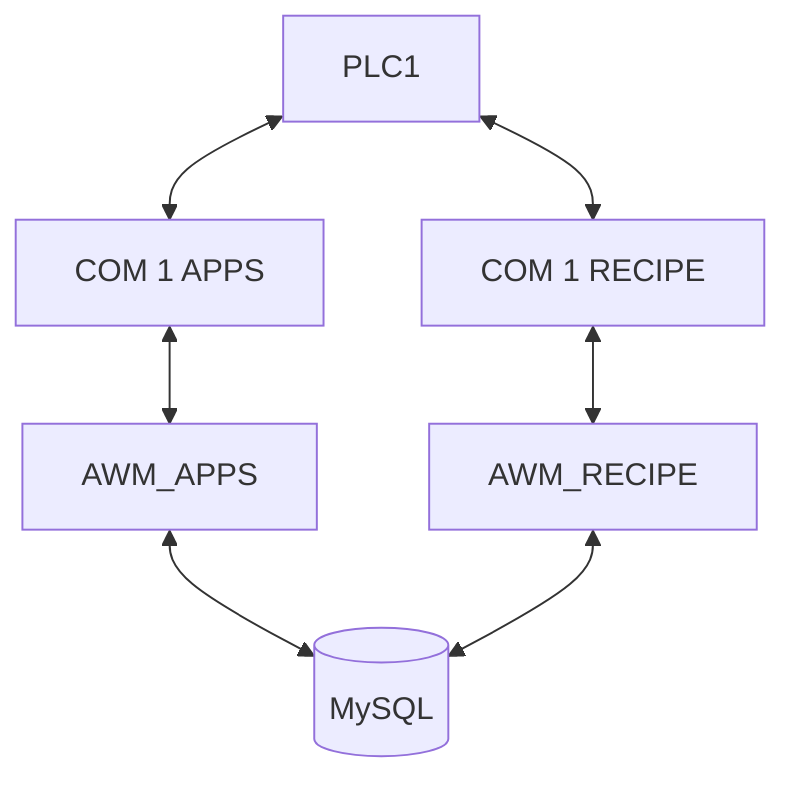

[< Retour](..\index.md)

# Procédure d'installation d'**A**rp **W**eb **M**achine

Avant de débuter l'installation du projet **ARP Web Machine**, il est nécessaire d'installer les logiciels requis pour le fonctionnement du serveur.

La procédure d'installation de ces logiciels est détaillée ici :

➡️ [Installation des logiciels nécessaires](_01_install_soft.md)

---

Une fois les logiciels installés, vous pouvez procéder à l'installation du projet **AWM** à l'aide du script automatique.

➡️ [Installation automatique AWM](_02_auto_deployement.md)

---

⚠️ En cas de problème avec l'installation automatique, il est possible d'effectuer une installation manuelle.

Cette méthode est **plus longue et plus complexe**, elle est donc **déconseillée sauf nécessité**.

➡️ [Installation manuelle AWM](_03_manual_deployement.md)

---

Une fois le déploiement terminé, une **configuration initiale** est nécessaire.

Pour effectuer cette configuration, consulter le **chapitre correspondant**.
