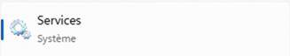
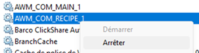
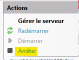

[< Retour](index.md)

# 🔄 Mise à jour automatique AWM

💡 La mise à jour **manuelle** nécessite de nombreuses actions.  
Il est donc **fortement recommandé d'utiliser la méthode automatique** lorsque cela est possible.

➡️ Si la mise à jour automatique ne peut pas être utilisée, la procédure ci‑dessous permet de réaliser la mise à jour **manuellement**.

---

## ⚠️ Éléments à préserver

Dans le dossier **AWM**, les éléments suivants **ne doivent jamais être modifiés ou supprimés** pendant une mise à jour :

```
venv/
logs/
.env
web/db/recipes/
web/src/media/
```

Ces éléments contiennent des informations spécifiques à l'installation :

- l’environnement Python (`venv`)
- les variables d’environnement (`.env`)
- la base de données
- les fichiers médias utilisateurs

---

# 🛑 Arrêter les services

<details>
<summary>📷 Capture écran</summary>




</details>

1. Ouvrir **Services Windows**
2. Arrêter les services suivants :

```
AWM_COM_APPS_1 → AWM_COM_APPS_5
AWM_COM_RECIPE_1 → AWM_COM_RECIPE_5
```

---

# 🌐 Arrêter les serveurs IIS

<details>
<summary>📷 Capture écran</summary>




</details>

1. Ouvrir le **Gestionnaire des services Internet (IIS)**
2. Cliquer sur l'élément **racine** en haut de l'arborescence
3. Cliquer sur **Arrêter**

---

# 📦 Procédure de mise à jour

## 1️⃣ Sauvegarde des éléments spécifiques

Préparer le dossier **AWM actuellement utilisé** (exemple : `C:\AWM`).

Créer un dossier temporaire :

```
C:\TMP\
```

Depuis le dossier existant **AWM**, copier les éléments suivants vers le dossier temporaire :

```
venv/ (optionnel)
.env (optionnel)
web/db/recipes/
web/src/media/
```

⚠️ Ces fichiers devront être **réintégrés après la copie du nouveau projet**.

---

## 2️⃣ Nettoyage de l'ancien projet

Dans le dossier **AWM** existant (ex : `C:\AWM`), supprimer **tous les fichiers et dossiers sauf** :

```
venv/
logs/
.env
```

💡 Pour plus de sécurité, vous pouvez les couper / coller dans un lieu de sauvegarde.

---

## 3️⃣ Copie du nouveau projet

Depuis le dossier **AWM du nouveau projet** (clé USB ou dossier réseau) :

Copier **tous les fichiers et dossiers sauf** :

```
venv/
logs/
.env
```

Puis coller ces fichiers dans le dossier de l'ancien projet :

```
C:\AWM\
```

---

## 4️⃣ Restauration des données spécifiques

Depuis le dossier temporaire (`C:\TMP`), remettre les dossiers suivants dans le projet (supprimer ceux présents):

```
web/db/recipes/
web/src/media/
```

Cela permet de restaurer :

- la base de données locale
- les médias utilisateurs
- les fichiers spécifiques à la machine

---

# ▶️ Redémarrer les serveurs IIS

1. Ouvrir le **Gestionnaire des services Internet (IIS)**
2. Cliquer sur l'élément racine en haut de l'arborescence
3. Cliquer sur **Redémarrer**

---

# ▶️ Redémarrer les services

1. Ouvrir **Services Windows**
2. Démarrer les services suivants :

```
AWM_COM_APPS_1 → AWM_COM_APPS_5
AWM_COM_RECIPE_1 → AWM_COM_RECIPE_5
```

---

# ✅ Vérifications

Après la mise à jour :

- vérifier que les **services COM sont actifs**
- vérifier que **les sites IIS sont démarrés**
- accéder à l'application :

```
RECIPE : http://localhost:8000/<ID>/
APPS   : http://localhost:9000/<ID>/
```

- vérifier que les **recettes et données sont toujours présentes** et que la modification des recettes fonctionne
