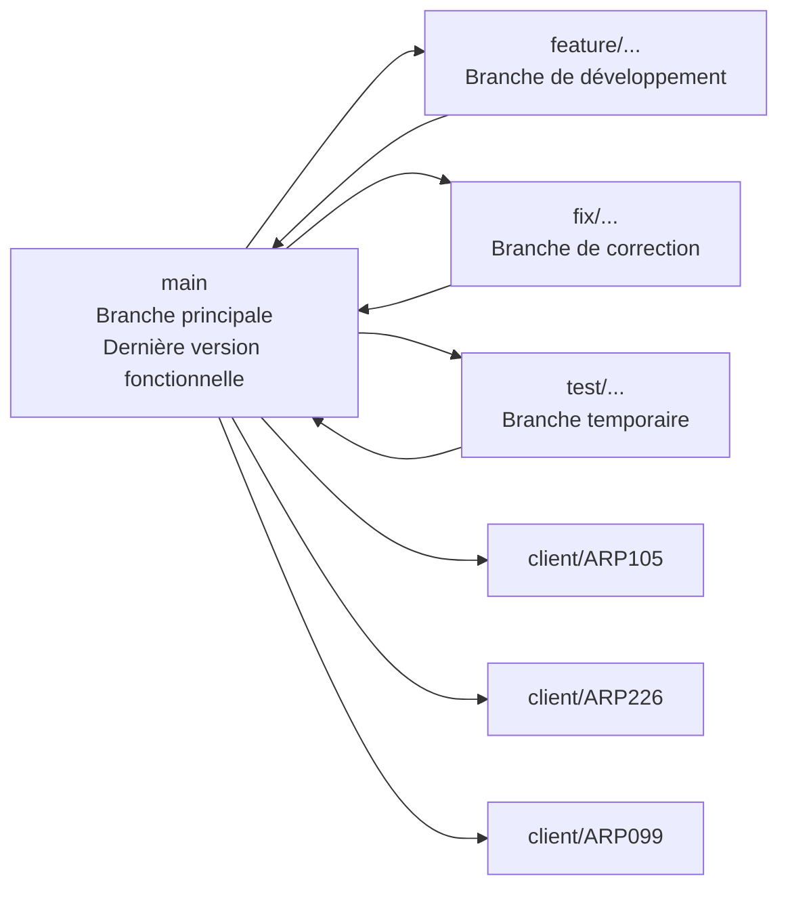
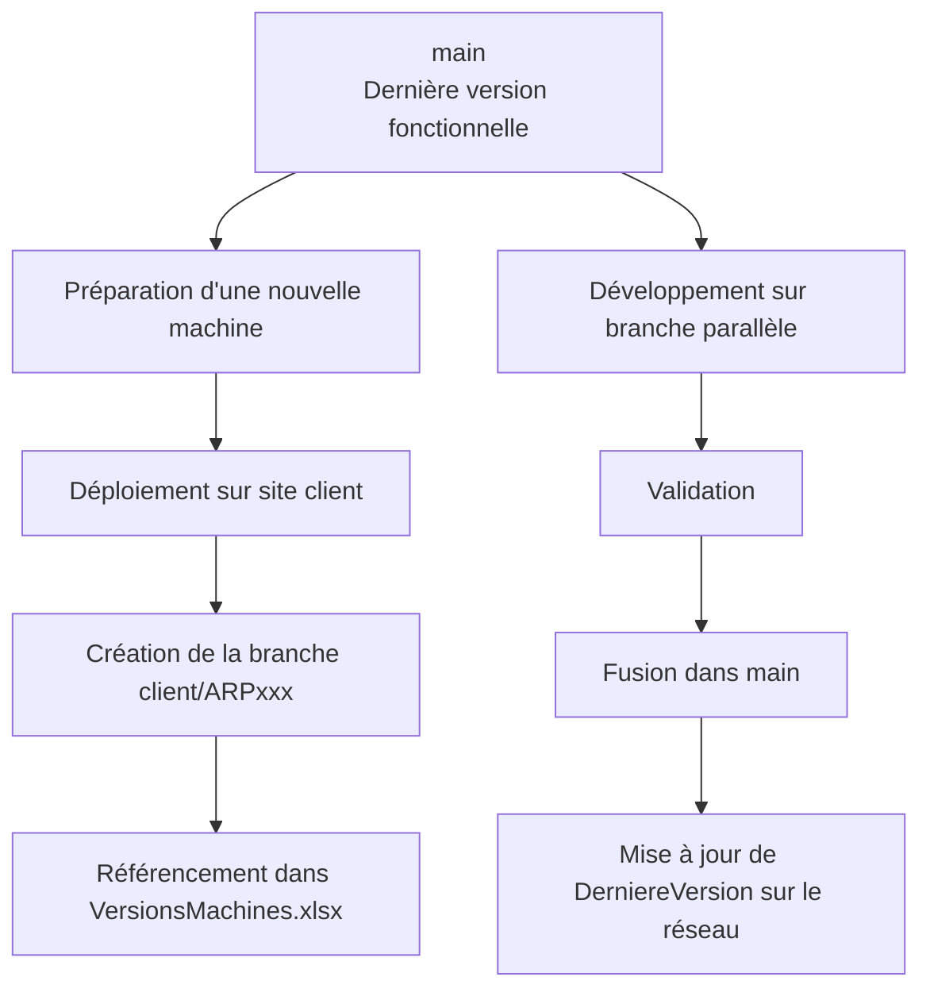
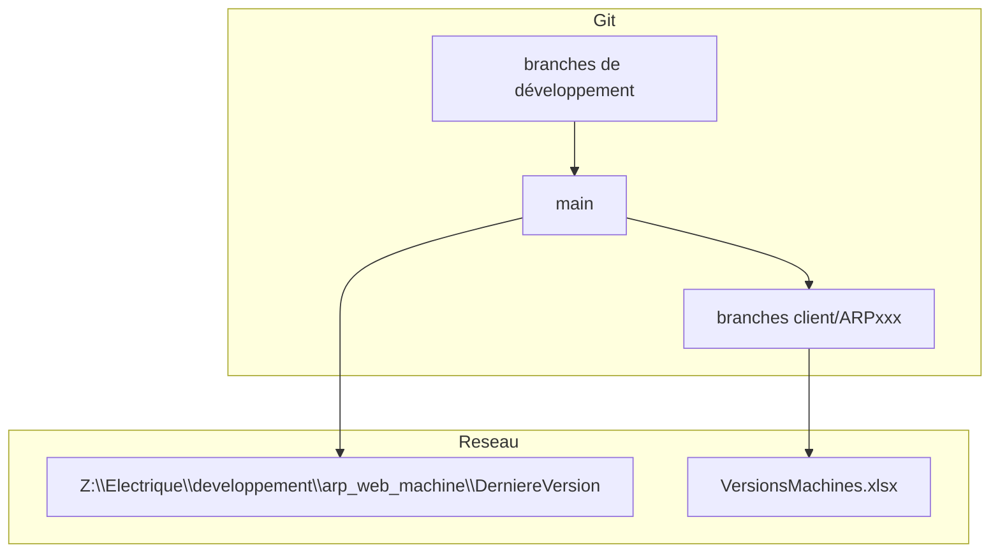
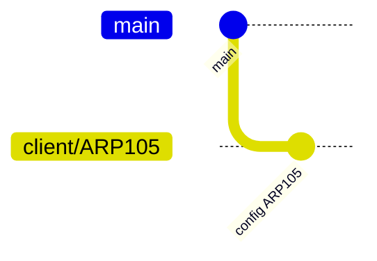

# Versionning du projet AWM

## Objectif

Cette documentation décrit les règles de versionning du projet **AWM** ainsi que la gestion des branches utilisées pour le développement, l'intégration et le suivi des machines installées chez les clients.

---

## Branche principale

La branche **`main`** est la branche de référence du projet.

Elle contient la **dernière version fonctionnelle validée** du projet **AWM**.

Toute nouvelle machine doit être initialisée à partir du projet présent sur **`main`**.

Il est de la responsabilité des développeurs de maintenir à jour :

```text
Z:\Electrique\developpement\arp_web_machine\DerniereVersion
```

Ce dossier doit contenir :

- la dernière version du projet issue de `main`
- une base de données initiale déjà migrée
- un état propre permettant de repartir rapidement sur une nouvelle installation

---

## Branches de développement

Les développements doivent être réalisés sur des **branches parallèles**.

Ces branches permettent de :

- développer de nouvelles fonctionnalités
- corriger des bugs
- tester des évolutions sans impacter `main`

Une fois le développement terminé :

1. la branche est fusionnée dans **`main`**
2. la branche de développement doit être **supprimée**

---

## Branches client

Une fois une machine installée chez un client, une branche dédiée doit être créée :

```text
client/ARPxxx
```

Exemple :

```text
client/ARP105
client/ARP226
client/ARP099
```

Cette branche permet :

- de figer l'état exact du projet installé sur site
- de retrouver facilement la version déployée
- de tracer les évolutions spécifiques à une machine ou un client

---

## Suivi des versions sur site

En cas de doute sur la version réellement installée chez un client, consulter le fichier :

```text
Z:\Electrique\developpement\arp_web_machine\VersionsMachines.xlsx
```

Ce fichier permet d'identifier :

- la machine concernée
- la branche associée
- l'identifiant Git (`commit`) déployé sur site

---

## Bonnes pratiques

- Toujours créer une nouvelle machine à partir de **`main`**
- Ne jamais développer directement sur **`main`**
- Supprimer les branches de développement une fois fusionnées
- Créer une branche **`client/ARPxxx`** dès qu'une machine est livrée
- Mettre à jour le dossier réseau **DerniereVersion**
- Renseigner correctement le fichier **VersionsMachines.xlsx**

---

# Branches



---

# Cycle de vie d’une machine



---

# Vue complète avec réseau



---

# Quelques commande utiles

Les projets sont sur la branche `main` jusqu'à l'installation.

Vous devez alors gérer la mise à jour éventuelle de votre projet.

Une fois installé, vous devez créer la branche client.

- Vérifier les modifications

```bash
git status
```

- Créer la branche depuis l’état actuel

```bash
git checkout -b client/ARPXXX
```

Cela :

crée la branche client/ARPXXX

bascule dessus

garde toutes les modifications

Aucun commit n’est fait sur `main`.

- Commit sur la branche client

```bash
git add .
git commit -m "Préparation version client ARPXXX"
```

- Envoyer sur le serveur

```bash
git push -u origin client/ARPXXX
```

- Vérification

```bash
git log --oneline --decorate
```

- Exemple complet

```bash
git status
git checkout -b client/ARP105
git add .
git commit -m "Configuration machine ARP105"
git push -u origin client/ARP105
```


