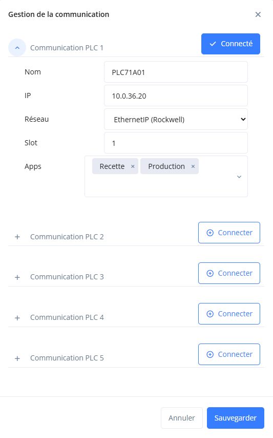

[< Retour](index.md)

# Configuration réseau

Configurer les communications avec les **PLCs** en renseignant leur adresse IP dans l'application.

---

## 1️⃣ Accéder à l'application

Ouvrir l'application dans un navigateur :

```
http://127.0.0.1:8xxx/fr/account/
```

## 2️⃣ Connexion

Si la page de connexion apparaît, utiliser les identifiants suivants :

**Nom d'utilisateur**

```
arp
```

**Mot de passe**

```
arp360arp360
```

---

## 3️⃣ Accéder à la configuration

1. Ouvrir la **barre de navigation** située à gauche.
2. Cliquer sur le bouton de configuration 

📝 Si la barre de navigation n'est pas visible, cliquer sur 

---

## 4️⃣ Configurer les communications PLC

Il est possible de configurer **jusqu'à 5 communications PLC**.

Pour activer une communication, cliquer sur le bouton **Connecter**
(bleu = communication active).


---

### Paramètres à renseigner

**Nom**

Nom du PLC
Exemple :

```
PLC71A01
```

**IP**

Adresse IP du contrôleur.

Pour **Rockwell**, utiliser l'adresse IP de la **carte réseau connectée au rack**
(ou l'adresse IP du PLC si connecté directement sur son port).

Exemple :

```
192.168.1.10
```

---

**Slot**

- Schneider : `0`
- Rockwell : emplacement du PLC dans le rack

```
0 = premier emplacement
1 = deuxième emplacement
```

---

**Apps**

Applications utilisant cette communication.

---

**Diagnostic**

Permet :

- l'analyse des couples
- l'analyse de la configuration machine

---

**Production**

Permet :

- la gestion de la production
- la gestion des événements

---

**Recette**

Permet la gestion des **recettes version Web**.

---

<details>
<summary>📷 Capture écran</summary>



</details>

---

# 🔄 Redémarrer les services COM

Au démarrage, les services **COM** récupèrent la configuration réseau depuis le serveur.

Si une communication n'était pas utilisée au moment du démarrage, elle peut rester **inactive pendant 1 heure**.

Pour éviter ce délai, il est recommandé **d'arrêter puis de redémarrer les services COM**.

## Grâce au script automatisé (conseillé)

1. Récupérer les outils sur le partage :

```
Z:\Electrique\developpement\arp_web_machine\Utilitaires\awm_utils
```

2. Copier le dossier sur la machine, par exemple :

```
C:\Tools\awm_utils
```

3. Ouvrir **PowerShell** ou **CMD** en mode administrateur
4. Se déplacer dans le dossier **awm_utils**

```bash
cd C:\Tools\awm_utils
```

3. Lancer le script :

```bash
py restart_services.py
```

## Manuellement

1. Ouvrir **Services Windows**
2. **Arrêté** puis **Redémarrer** les services suivants :

```
AWM_COM_APPS_1 → AWM_COM_APPS_5
AWM_COM_RECIPE_1 → AWM_COM_RECIPE_5
```

---

# ✅ Vérifications

Après la mise à jour :

- vérifier que les **services COM sont actifs**
- accéder à l'application :

```
RECIPE : http://localhost:8000/<ID>/
APPS   : http://localhost:9000/<ID>/
```

- vérifier que la modification des recettes fonctionne
