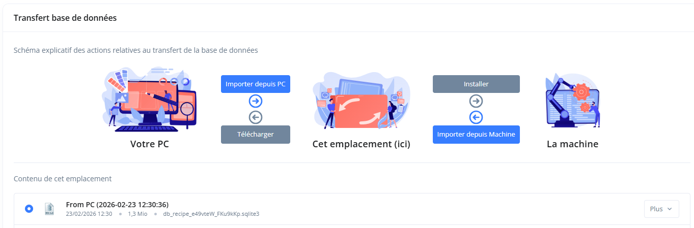
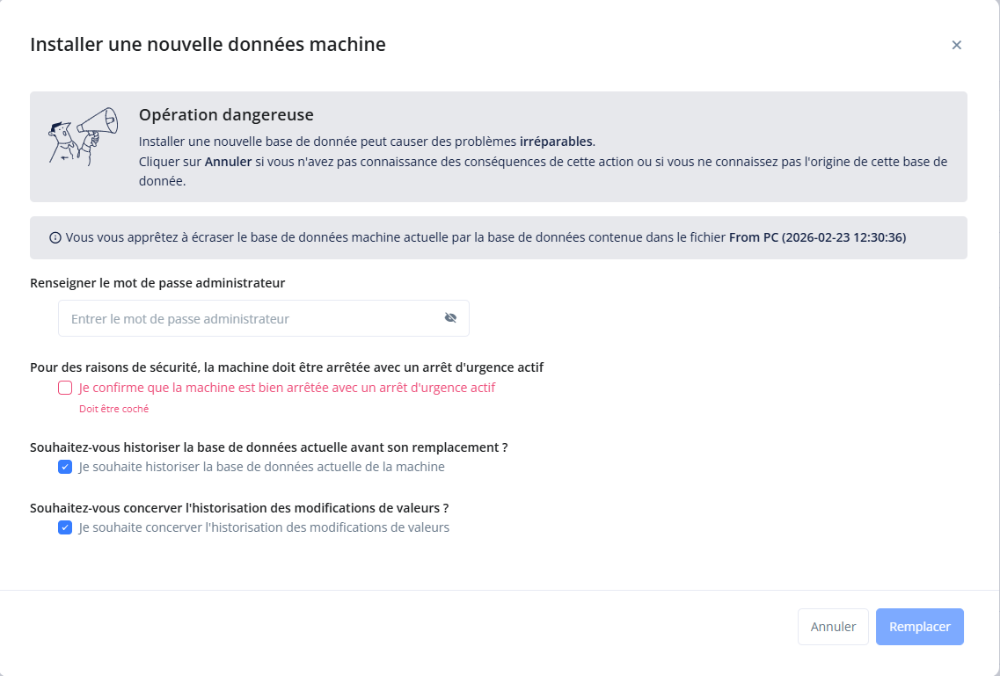
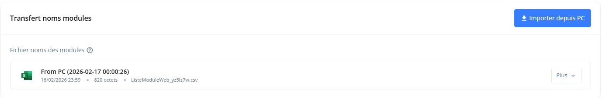

[< Retour](index.md)

# Configuration application Recette

L'application **Recette** permet :

- la gestion des **bases de données de recettes machine**
- l'installation de nouvelles **recettes sur la machine**
- la récupération des **recettes depuis la machine**
- l'**historisation** des actions liées aux recettes'

---

# Sommaire

- [Accès à la configuration](#accès-à-la-configuration)
- [Transfert de base de données](#transfert-de-base-de-données)
  - [Importer une base depuis le PC](#importer-une-base-depuis-le-pc)
  - [Installer la base sur la machine](#installer-la-base-sur-la-machine)
  - [Récupérer la base depuis la machine](#récupérer-la-base-depuis-la-machine)

- [Importer les noms des modules](#importer-les-noms-des-modules)

---

# Accès à la configuration

Ouvrir l’interface de gestion des recettes dans un navigateur :

```
http://127.0.0.1:8000/recipe-ext/databases/0/admin/
```

Cette page permet de :

- transférer les **bases de données de recettes**
- installer une base sur la **machine**
- récupérer la base de la **machine**
- importer les **noms des modules**

---

# Transfert de base de données

La section **Transfert base de données** permet de gérer les bases de recettes entre :

- **Votre PC**
- **Le serveur AWM**
- **La machine**

## Principe

Le transfert s'effectue en **deux étapes** :

1️⃣ importer une base depuis le PC vers le serveur

2️⃣ installer cette base sur la machine



---

# Importer une base depuis le PC

Dans la section **Transfert base de données** :

1. Cliquer sur le bouton :

```
Importer depuis PC
```

2. Sélectionner le fichier contenant les recettes.

Exemple :

```
recipe.sqlite3
```

3. Le fichier apparaît alors dans la liste des bases disponibles.

Exemple :

```
From PC (2026-02-23 12:30:36)
db_recipe.sqlite3
```

---

# Installer la base sur la machine

Une fois la base importée :

1️⃣ sélectionner la base dans la liste à l’aide de la **coche ronde à gauche**

2️⃣ cliquer sur le bouton :

```
Installer
```

(icone **dossier → machine**)

---

### Installation via le menu "Plus"

Il est également possible :

1. cliquer sur **Plus** à droite du fichier
2. cliquer sur **Installer**

Cette action est **strictement équivalente**.

---

### Confirmation d'installation

<details>
<summary>📷 Capture écran</summary>

</details>

Lors de l’installation, le système demande une confirmation.

Saisir le code :

```
arp360arp360
```

Puis :

- cocher la case confirmant que **l’arrêt d’urgence est actif**
- cliquer sur le bouton :

```
Remplacer
```

La base de données sera alors **installée sur la machine**.

---

# Récupérer la base depuis la machine

Il est également possible de **récupérer la base de recettes actuellement présente sur la machine**.

Dans la section **Transfert base de données** :

1️⃣ cliquer sur :

```
Importer depuis Machine
```

La base de données de la machine sera alors **copiée dans la liste locale**.

---

### Télécharger la base sur le PC

Une fois la base visible dans la liste :

1️⃣ sélectionner la base avec la **coche ronde**

2️⃣ cliquer sur :

```
Télécharger
```

La base sera téléchargée sur votre PC.

---

### Téléchargement via le menu "Plus"

Comme pour l’installation :

1. cliquer sur **Plus** à droite du fichier
2. cliquer sur **Télécharger**

Cette action est **équivalente**.

---

# Importer les noms des modules

<details>
<summary>📷 Capture écran</summary>


</details>

La section **Transfert noms modules** permet d’importer la liste des modules de la machine.

Cette liste est utilisée pour :

- afficher les **noms des modules**
- associer les **recettes aux modules**

---

## Import du fichier

Dans la section **Transfert noms modules** :

1️⃣ cliquer sur :

```
Importer depuis PC
```

2️⃣ sélectionner le fichier CSV contenant la liste des modules.

Exemple :

```
ListeModuleWeb.csv
```

3️⃣ le fichier sera alors importé dans l’application.

Le fichier doit être configurer comme suit :

```
Num Module,Nom Arp, Nom Français, Nom Anglais, Nom Espangol, Nom Allemand, Nom Gréc
```

Exemple si langues `Arp` / `Anglais` :

```
1,30A - Châssis machine,,30A - Machine frame
2,03D - Robot chargement courroie centrale,,03D - Main belt loading robot
...
```
