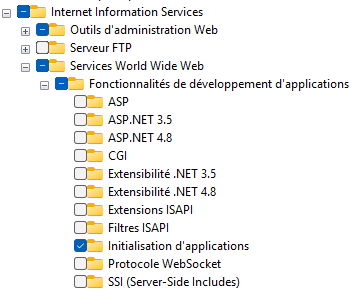
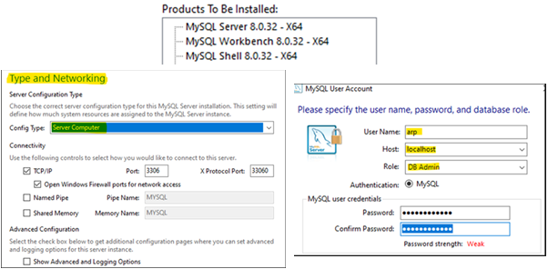
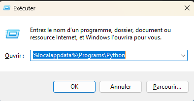
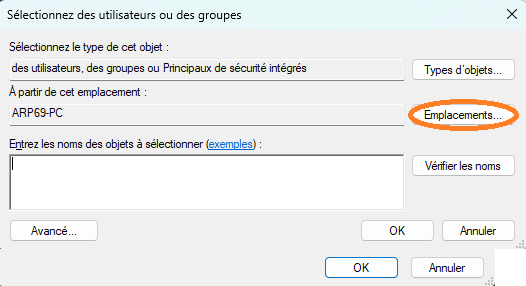
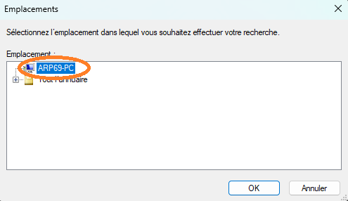
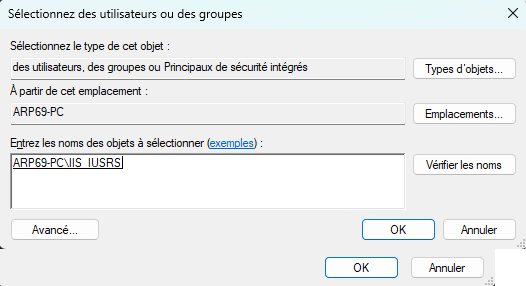
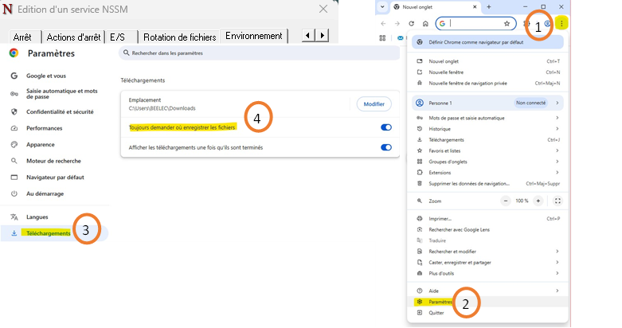

[< Retour](index.md)

# Installation des logiciels nécessaires

## Sommaire

- [Prérequis](#prérequis)
- [Logiciels utilisés](#logiciels-utilisés)
- [Résumé ultra rapide](#résumé-ultra-rapide)
- [1️⃣ Activer IIS](#1️⃣-activer-iis)
- [2️⃣ Installer httpPlatformHandler](#2️⃣-installer-httpplatformhandler)
- [3️⃣ Installer MySQL](#3️⃣-installer-mysql)
- [4️⃣ Installer Python 3.9](#4️⃣-installer-python-39)
- [5️⃣ Donner les droits IIS sur Python](#5️⃣-donner-les-droits-iis-sur-python)
- [6️⃣ Installer NSSM](#6️⃣-installer-nssm)
- [7️⃣ Installer Google](#7️⃣-installer-google)
- [8️⃣ Vérifications rapides](#8️⃣-vérifications-rapides)

---

Cette section décrit l'installation des logiciels nécessaires
au fonctionnement du serveur **ARP Web Machine**.

⚠️ Cette étape doit être réalisée **avant toute installation du projet**.

---

## Prérequis

- Windows 10 / Windows 11
- Récupérer le dossier suivant sur le partage :

```
Z:\Electrique\developpement\arp_web_machine\Logiciels
```

---

## Logiciels utilisés

Le serveur utilise les composants suivants :

- **IIS** : serveur web Windows
- **httpPlatformHandler** : permet d'exécuter l'application Python via IIS
- **Python 3.9** : runtime de l'application
- **MySQL** : base de données
- **NSSM** : gestion du service Windows

⚠️ Utiliser les versions fournies afin de garantir la compatibilité avec l'application.

Fichiers nécessaires :

- `python-3.9.1-amd64.exe`
- `mysql-installer-community-8.0.35.0.msi`
- `nssm.exe`
- `httpPlatformHandler_amd64.msi`

---

# Résumé ultra rapide

1. Activer **IIS**
2. Installer **httpPlatformHandler**
3. Installer **MySQL**
4. Installer **Python 3.9**
5. Donner les droits **IIS_IUSRS** sur Python
6. Copier **nssm.exe**
7. Lancer le script d'installation

---

# 1️⃣ Activer IIS

1. Ouvrir **Panneau de configuration**
2. Aller dans :

```
Programmes → Activer ou désactiver des fonctionnalités Windows
```

3. Développer :

```
Internet Information Services
→ World Wide Web Services
→ Fonctionnalités de développement d’applications
```

4. Cocher :

```
Initialisation d'applications
```

<details>
<summary>📷 Capture écran</summary>



</details>

5. Cliquer **OK**

---

# 2️⃣ Installer httpPlatformHandler

1. Lancer :

```
httpPlatformHandler_amd64.msi
```

2. Installer normalement :

```
Next → Finish
```

---

# 3️⃣ Installer MySQL

1. Lancer :

```
mysql-installer-community-8.0.35.0.msi
```

<details>
<summary>📷 Capture écran</summary>



</details>

### Setup Type

1. Choisir **Custom**

2. Sélectionner les produits suivants :

- Server
- Workbench
- Shell

3. Cliquer :

```
Next → Execute
```

### Type and Networking

Choisir :

```
Server Computer
```

### Authentication

Choisir :

```
Use Strong Password Encryption
```

### Configurer root

User :

```
root
```

Mot de passe :

```
arp360arp360
```

### Ajouter un utilisateur

Cliquer **Add User**

User Name :

```
arp
```

Host :

```
localhost
```

Role :

```
DB Admin
```

Mot de passe :

```
arp360arp360
```

Puis cliquer :

```
Next
```

### Windows Service

- Laisser les paramètres par défaut
- Cliquer **Next**

### Server File Permissions

Choisir :

```
Yes, grant full access [...]
```

Puis :

```
Execute → Next
```

Décocher :

- Launch MySQL Workbench
- Launch MySQL Shell

Cliquer :

```
Finish
```

---

# 4️⃣ Installer Python 3.9

Lancer :

```
python-3.9.1-amd64.exe
```

### Important

Cocher :

```
Add Python 3.9 to PATH
```

Puis cliquer :

```
Install Now
```

À la fin :

Cliquer sur :

```
Disable Path Limit
```

<details>
<summary>📷 Capture écran</summary>


</details>

---

# 5️⃣ Donner les droits IIS sur Python

⚠️ Obligatoire si Python est installé en mode utilisateur.

1. Appuyer sur :

```
Windows + R
```

2. Taper :

```
%localappdata%\Programs\Python
```

<details>
<summary>📷 Capture écran</summary>



</details>

3. Clic droit sur :

```
Python39
```

4. Aller dans :

```
Propriétés → Sécurité → Modifier → Ajouter
```

5. Cliquer sur :
<details>
<summary>📷 Capture écran</summary>



</details>

```
Emplacements...
```

6. Sélectionner l'élément le plus haut puis cliquer **OK**
<details>
<summary>📷 Capture écran</summary>



</details>

7. Dans :

```
Entrez les noms des objets
```

taper :

```
IIS_IUSRS
```

8. Cliquer :
<details>
<summary>📷 Capture écran</summary>



</details>

```
Vérifier les noms
```

9. Cliquer **OK**

---

# 6️⃣ Installer NSSM

Copier :

```
nssm.exe
```

dans :

```
C:\nssm\
```

Créer le dossier si nécessaire.

Vérifier :

```
C:\nssm\nssm.exe
```

---

# 7️⃣ Installer Google

1. Lancer :

```
ChromeSetup.exe
```

2. Suivre l'installation.

3. Lors de la première ouverture :

- Cliquer sur **Ne pas se connecter**
- Dans la liste des navigateurs proposés, sélectionner **Google Chrome**
- Cliquer sur **Définir par défaut**

4. Configuration

- Ouvrir les **Paramètres**
- Aller dans :

```
Téléchargements
```

- Activer l'option :

```
Toujours demander où enregistrer les fichiers
```

💡 Cette option permet de choisir l'emplacement des fichiers téléchargés, ce qui évite qu'ils soient enregistrés automatiquement dans le dossier _Téléchargements_.

<details>
<summary>📷 Capture écran</summary>



</details>

---

# 8️⃣ Vérifications rapides

Dans **PowerShell** :

### Vérifier Python

```bash
python --version
```

Résultat attendu :

```
Python 3.9.x
```

### Vérifier MySQL

```bash
mysql --version
```

Résultat attendu :

```
Ver 8.0.x
```
