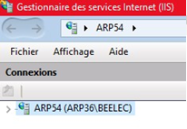
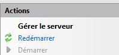

[< Retour](index.md)

# Mise à jour manuelle AWM

Ce script permet de **mettre à jour une installation AWM existante** à partir d’une version plus récente du projet.

Le script copie les nouveaux fichiers tout en **préservant les éléments spécifiques à l'installation** (base de données, médias, environnement).

Les éléments suivants **ne sont jamais modifiés** pendant la mise à jour :

```
venv/
logs/
.env
web/db/
web/src/media/
```

Cela permet de conserver :

- l’environnement Python
- les variables d’environnement
- la base de données
- les fichiers médias utilisateurs

Cette documentation explique **comment utiliser l'outil de mise à jour**, mais ne détaille pas toutes les actions effectuées.

⚠️ Si l'outil ne peut pas être utilisé, la documentation suivante explique **les actions pouvant être réalisées manuellement** :

➡️ [Mise à jour manuelle AWM](_02_manual_update.md)

---

## Sommaire

- [Prérequis](#-prérequis)
- [Bonnes pratiques](#-bonnes-pratiques)
- [Utilisation](#-utilisation)
- [Arrêter les services (optionel mais conseillé)](#arrêter-les-services-optionel-mais-conseillé)
- [Vérification de la connexion internet](#-vérification-de-la-connexion-internet)
- [Redémarrer les services (obligatoire)](#redémarrer-les-services-obligatoire)
- [Redémarrer les serveurs IIS (obligatoire)](#redémarrer-les-serveurs-iis-obligatoire)

---

## 📋 Prérequis

Avant d'utiliser le script :

- Python **3.9** installé
- Une installation **AWM existante fonctionnelle**
- Une **version plus récente du projet AWM**
- Les services **IIS peuvent rester actifs** (aucun arrêt obligatoire)

Récupérer les outils sur le partage :

```
Z:\Electrique\developpement\arp_web_machine\Utilitaires\awm_utils
```

- Récupérer le projet de base sur le partage :

```
Z:\Electrique\developpement\arp_web_machine\DerniereVersion\AWM
```

---

## 💡 Bonnes pratiques

Avant une mise à jour :

- vérifier que l’application fonctionne correctement
- sauvegarder la base de données
- sauvegarder les **recettes**

---

# Arrêter les services (optionel mais conseillé)

1. Ouvrir **PowerShell** ou **CMD** en mode administrateur
2. Se déplacer dans le dossier **awm_utils**

```bash
cd C:/.../awm_utils
```

3. Lancer le script :

```bash
py stop_services.py
```

## 🚀 Utilisation

1. Ouvrir **PowerShell** ou **CMD** en mode administrateur
2. Se déplacer dans le dossier **awm_utils**

```bash
cd C:/.../awm_utils
```

3. Lancer le script :

```bash
py update.py
```

Le script demandera :

```
Chemin du dossier AWM récent (source)
Chemin du dossier AWM existant (cible)
```

Exemple :

```
AWM récent : D:\Dev\AWM_NEW
AWM existant : C:\AWM
```

---

# 🌐 Vérification de la connexion internet

Le script vérifie si une connexion internet est disponible.

Si **aucune connexion n'est détectée** :

```
Utiliser wheelhouse du dossier source pour mettre à jour la venv hors ligne ? (y/n)
```

La venv sera mise à jour grâce au dossier wheelhouse (voir avec developpeur si nécessaire)

```
Continuer sans mettre à jour la venv ? (y/n)
```

L'utilisateur peut choisir de continuer ou d'annuler.

---

# Redémarrer les services (obligatoire)

1. Ouvrir **PowerShell** ou **CMD** en mode administrateur
2. Se déplacer dans le dossier **awm_utils**

```bash
cd C:/.../awm_utils
```

3. Lancer le script :

```bash
py restart_services.py
```

---

# Redémarrer les serveurs IIS (obligatoire)

<details>
<summary>📷 Capture écran</summary>



</details>

1. Ouvrir le **Gestionnaire des services Internet (IIS)**
2. Cliquer sur l'élément **racine** en haut de l'arborescence
3. Cliquer sur **Redémarrer**

# ✅ Vérifications

Après la mise à jour :

- vérifier que les **services COM sont actifs**
- vérifier que **les sites IIS sont démarrés**
- accéder à l'application :

```
RECIPE : http://localhost:8000/<ID>/
APPS   : http://localhost:9000/<ID>/
```

- vérifier que les **recettes et données sont toujours présentes** et que la modification des recettes fonctionne
