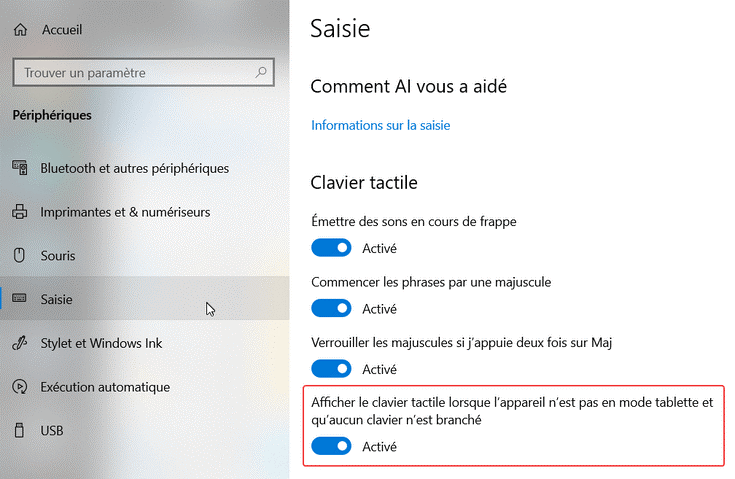
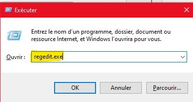
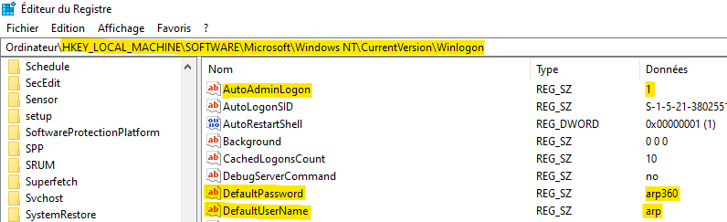

[< Retour](../index.md)

# **Configuration d'un superviseur**

## Activer le clavier virtuel

- Appuyer sur la touche **Windows**
- Puis aller dans **Paramètres** > **Périphériques** > **Saisie** puis :
- Cocher **Afficher le clavier tactile lorsque l'appareil n'est pas en mode tablette et qu'auncun clavier n'est branché**.

📷 Capture écran

- S’il n’y a **aucun clavier branché au superviseur**, Windows ouvrira **automatiquement un clavier virtuel**.

## Se connecter automatiquement a la session utilisateur

- Appuyer sur **Windows + R** et taper **`regedit.exe`**.

📷 Capture écran

- Puis se rendre dans :

  `HKEY_LOCAL_MACHINE\SOFTWARE\Microsoft\WindowsNT\CurrentVersion\Winlogon`

- Ajouter **3 valeurs chaîne**
  *(clic droit → Nouveau → Valeur chaîne)* et modifier leur valeur comme suit :

**Note:** **Username** et **Password** dépendent du superviseur.
Voir **Organisation Mémoire → Fiche Machine**.

- **AutoAdminLogon**
  - Valeur : `1`

- **DefaultUserName**
  - Valeur : `[USERNAME]`

- **DefaultPassword**
  - Valeur : `[PASSWORD]`

📷 Capture écran

