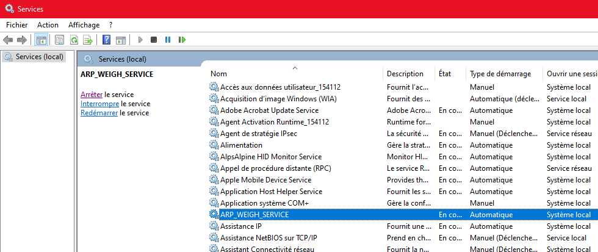

[< Retour](index.md)

# Redémarrer un service

Pour redémarrer un service, il suffit de se rendre dans l'application **Services** de Windows.

Puis, sélectionner le service souhaité et cliquer sur **Redémarrer**.

Le service va alors redémarrer.