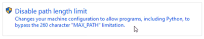

[< Retour](index.md)

# Installation des logiciels nécessaires

## Sommaire

- [Prérequis](#prérequis)
- [Logiciels utilisés](#logiciels-utilisés)
- [Installer Python 3.9](#installer-python-39)
- [Installer NSSM](#installer-nssm)
- [Vérifications rapides](#vérifications-rapides)

---

Cette section décrit l'installation des logiciels nécessaires
au fonctionnement du programme de pesage  **ARP Weigh Service**.

⚠️ Cette étape doit être réalisée **avant toute installation du projet**.

## Prérequis

Récupérer le dossier suivant sur le partage :

```
Z:\Electrique\developpement\arp_weigh_service\Logiciel
```

## Logiciels utilisés

Le programme utilise les composants suivants :

- **Python 3.9** : runtime de l'application
- **NSSM** : gestion du service Windows

⚠️ Utiliser les versions fournies afin de garantir la compatibilité avec l'application.

Fichiers nécessaires :

- `python-3.9.1-amd64.exe`
- `nssm.exe`


## Installer Python 3.9

Lancer :

```
python-3.9.1-amd64.exe
```

### Important

Cocher :

```
Add Python 3.9 to PATH
```

Puis cliquer :

```
Install Now
```

À la fin :

Cliquer sur :

```
Disable Path Limit
```

<details>
<summary>📷 Capture écran</summary>



</details>


## Installer NSSM

Copier :

```
nssm.exe
```

dans :

```
C:\nssm\
```

Créer le dossier si nécessaire.

Vérifier :

```
C:\nssm\nssm.exe
```


## Vérifications rapides

Dans **PowerShell** :

### Vérifier Python

```bash
python --version
```

Résultat attendu :

```
Python 3.9.x
```

## Etape suivante
Passer à l'installation du projet :
-  **[Installation d'**A**rp **W**eigh **S**ervice](_02_manual_deployement.md)**